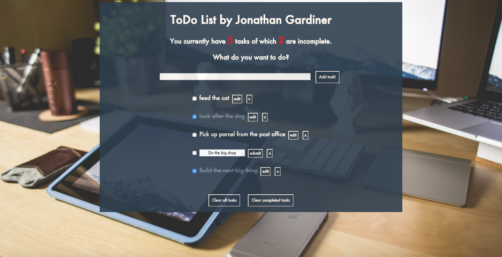

# ToDo List
## Features:

Users can add tasks to the do list.

Users can mark a task as complete and the task will change color and strikethrough.

Users can delete individual tasks, all completed tasks or all tasks regardless of whether they're completed or not.

Users can edit individual tasks and the task list will update and remain the order.

Users have a number of total tasks at the top of the page so they don't have to count them all.


Users can see a total number of incomplete tasks and a total for complete tasks.




## Installation:

You can try the ToDo List online:

jonathantodolist.herokuapp.com

or install it locally:

From the command line...

```
$ git clone git@github.com:jelgar/todo-challenge.git
$ cd todo-challenge
$ npm install
$ open index.html

```

## Technologies:

* JavaScript
* AngularJS
* JQuery
* html
* CSS
* Jasmine
* Protractor
* Karma


## Contributors:

Jonathan Gardiner
